<!-- README.md is generated from README.Rmd. Please edit that file -->

# SynergyLMM

<!-- badges: start -->
<!-- badges: end -->

A comprehensive statistical framework for designing and analyzing *in
vivo* drug combination experiments.

## Installation

You can install the development version of SynergyLMM from
[GitHub](https://github.com/) with:

``` r
# install.packages("pak")
pak::pak("RafRomB/SynergyLMM")
```

## Example Use of SynergyLMM

This is a basic example which shows how to use SynergyLMM to analyze
synergy in a 2-drug combination *in vivo* experiment.

``` r
library(SynergyLMM)
```

We start by loading the data (in long format). We will use the example
data provided in the package:

``` r
data("grwth_data")
```

### 1. Fit Model

The first step is fitting the model from our data:

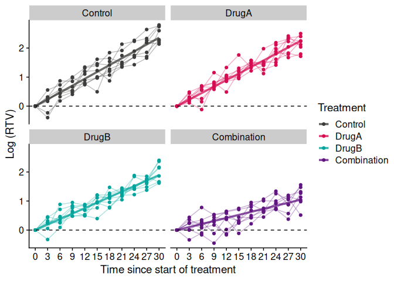 We can
obtain the model estimates using:

``` r
lmmModel_estimates(lmm)
#>             Control      DrugA      DrugB Combination   sd_ranef  sd_resid
#> estimate 0.07855242 0.07491984 0.06306986  0.03487933 0.03946667 0.2124122
```

### 2. Synergy Analysis

**Bliss independence model**

``` r
lmmSynergy(lmm, method = "Bliss")
```

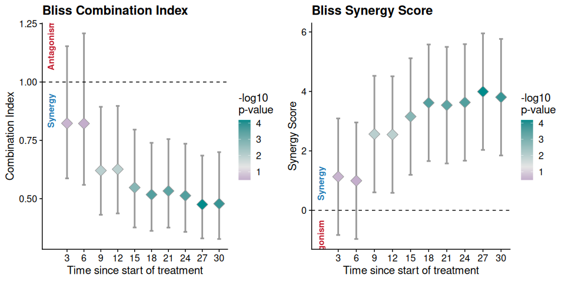

    #> $Contrasts
    #> $Contrasts$Time3
    #> 
    #>  Estimate Std. Error     z Pr(>|z|)   S  2.5 % 97.5 %
    #>   -0.0649     0.0574 -1.13    0.258 2.0 -0.177 0.0476
    #> 
    #> Term: b4 = b2 + b3 - b1
    #> Columns: term, estimate, std.error, statistic, p.value, s.value, conf.low, conf.high 
    #> 
    #> 
    #> $Contrasts$Time6
    #> 
    #>  Estimate Std. Error      z Pr(>|z|)   S   2.5 % 97.5 %
    #>   -0.0326     0.0327 -0.996    0.319 1.6 -0.0968 0.0316
    #> 
    #> Term: b4 = b2 + b3 - b1
    #> Columns: term, estimate, std.error, statistic, p.value, s.value, conf.low, conf.high 
    #> 
    #> 
    #> $Contrasts$Time9
    #> 
    #>  Estimate Std. Error     z Pr(>|z|)   S   2.5 %  97.5 %
    #>    -0.053     0.0207 -2.56   0.0103 6.6 -0.0935 -0.0125
    #> 
    #> Term: b4 = b2 + b3 - b1
    #> Columns: term, estimate, std.error, statistic, p.value, s.value, conf.low, conf.high 
    #> 
    #> 
    #> $Contrasts$Time12
    #> 
    #>  Estimate Std. Error     z Pr(>|z|)   S  2.5 %   97.5 %
    #>    -0.039     0.0153 -2.55   0.0108 6.5 -0.069 -0.00901
    #> 
    #> Term: b4 = b2 + b3 - b1
    #> Columns: term, estimate, std.error, statistic, p.value, s.value, conf.low, conf.high 
    #> 
    #> 
    #> $Contrasts$Time15
    #> 
    #>  Estimate Std. Error     z Pr(>|z|)   S  2.5 %  97.5 %
    #>   -0.0401     0.0127 -3.15  0.00161 9.3 -0.065 -0.0152
    #> 
    #> Term: b4 = b2 + b3 - b1
    #> Columns: term, estimate, std.error, statistic, p.value, s.value, conf.low, conf.high 
    #> 
    #> 
    #> $Contrasts$Time18
    #> 
    #>  Estimate Std. Error     z Pr(>|z|)    S   2.5 %  97.5 %
    #>   -0.0366     0.0101 -3.62   <0.001 11.7 -0.0564 -0.0168
    #> 
    #> Term: b4 = b2 + b3 - b1
    #> Columns: term, estimate, std.error, statistic, p.value, s.value, conf.low, conf.high 
    #> 
    #> 
    #> $Contrasts$Time21
    #> 
    #>  Estimate Std. Error     z Pr(>|z|)    S   2.5 %  97.5 %
    #>   -0.0299    0.00846 -3.54   <0.001 11.3 -0.0465 -0.0134
    #> 
    #> Term: b4 = b2 + b3 - b1
    #> Columns: term, estimate, std.error, statistic, p.value, s.value, conf.low, conf.high 
    #> 
    #> 
    #> $Contrasts$Time24
    #> 
    #>  Estimate Std. Error     z Pr(>|z|)    S   2.5 %  97.5 %
    #>   -0.0278    0.00766 -3.63   <0.001 11.8 -0.0428 -0.0128
    #> 
    #> Term: b4 = b2 + b3 - b1
    #> Columns: term, estimate, std.error, statistic, p.value, s.value, conf.low, conf.high 
    #> 
    #> 
    #> $Contrasts$Time27
    #> 
    #>  Estimate Std. Error     z Pr(>|z|)    S   2.5 % 97.5 %
    #>   -0.0275     0.0069 -3.99   <0.001 13.9 -0.0411 -0.014
    #> 
    #> Term: b4 = b2 + b3 - b1
    #> Columns: term, estimate, std.error, statistic, p.value, s.value, conf.low, conf.high 
    #> 
    #> 
    #> $Contrasts$Time30
    #> 
    #>  Estimate Std. Error     z Pr(>|z|)    S   2.5 %  97.5 %
    #>   -0.0246    0.00645 -3.81   <0.001 12.8 -0.0372 -0.0119
    #> 
    #> Term: b4 = b2 + b3 - b1
    #> Columns: term, estimate, std.error, statistic, p.value, s.value, conf.low, conf.high 
    #> 
    #> 
    #> 
    #> $Synergy
    #>    Model Metric  Estimate        lwr       upr         pval Time
    #> 1  Bliss     CI 0.8229665  0.5872062 1.1533834 2.579032e-01    3
    #> 2  Bliss     CI 0.8221770  0.5593887 1.2084173 3.190110e-01    6
    #> 3  Bliss     CI 0.6208242  0.4312539 0.8937256 1.033643e-02    9
    #> 4  Bliss     CI 0.6263864  0.4371340 0.8975735 1.081171e-02   12
    #> 5  Bliss     CI 0.5478166  0.3769349 0.7961668 1.605259e-03   15
    #> 6  Bliss     CI 0.5176217  0.3623021 0.7395271 2.972850e-04   18
    #> 7  Bliss     CI 0.5332866  0.3764318 0.7555010 4.037916e-04   21
    #> 8  Bliss     CI 0.5132132  0.3580036 0.7357127 2.831685e-04   24
    #> 9  Bliss     CI 0.4754203  0.3300312 0.6848579 6.535614e-05   27
    #> 10 Bliss     CI 0.4786726  0.3275199 0.6995835 1.416473e-04   30
    #> 11 Bliss     SS 1.1313609 -0.8286031 3.0913249 2.579032e-01    3
    #> 12 Bliss     SS 0.9964923 -0.9634717 2.9564563 3.190110e-01    6
    #> 13 Bliss     SS 2.5643664  0.6044025 4.5243304 1.033643e-02    9
    #> 14 Bliss     SS 2.5487265  0.5887625 4.5086905 1.081171e-02   12
    #> 15 Bliss     SS 3.1549495  1.1949856 5.1149135 1.605259e-03   15
    #> 16 Bliss     SS 3.6176544  1.6576904 5.5776184 2.972850e-04   18
    #> 17 Bliss     SS 3.5375932  1.5776292 5.4975572 4.037916e-04   21
    #> 18 Bliss     SS 3.6302302  1.6702662 5.5901942 2.831685e-04   24
    #> 19 Bliss     SS 3.9925877  2.0326237 5.9525517 6.535614e-05   27
    #> 20 Bliss     SS 3.8052741  1.8453101 5.7652380 1.416473e-04   30
    #> 
    #> attr(,"SynergyLMM")
    #> [1] "lmmSynergy"

**Highest Single Agent model**

``` r
lmmSynergy(lmm, method = "HSA")
```

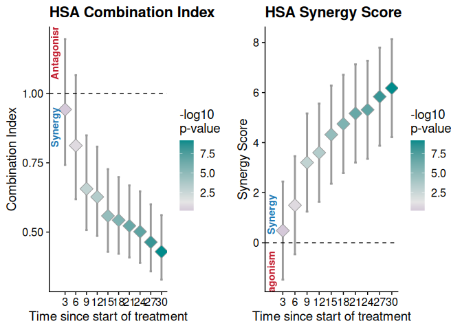

    #> $Contrasts
    #> $Contrasts$Time3
    #> 
    #>  Estimate Std. Error      z Pr(>|z|)   S   2.5 % 97.5 %
    #>   -0.0197     0.0406 -0.486    0.627 0.7 -0.0993 0.0598
    #> 
    #> Term: b4 = b3
    #> Columns: term, estimate, std.error, statistic, p.value, s.value, conf.low, conf.high 
    #> 
    #> 
    #> $Contrasts$Time6
    #> 
    #>  Estimate Std. Error    z Pr(>|z|)   S   2.5 % 97.5 %
    #>   -0.0347     0.0232 -1.5    0.134 2.9 -0.0801 0.0107
    #> 
    #> Term: b4 = b3
    #> Columns: term, estimate, std.error, statistic, p.value, s.value, conf.low, conf.high 
    #> 
    #> 
    #> $Contrasts$Time9
    #> 
    #>  Estimate Std. Error    z Pr(>|z|)   S   2.5 %  97.5 %
    #>   -0.0468     0.0146 -3.2  0.00135 9.5 -0.0754 -0.0182
    #> 
    #> Term: b4 = b3
    #> Columns: term, estimate, std.error, statistic, p.value, s.value, conf.low, conf.high 
    #> 
    #> 
    #> $Contrasts$Time12
    #> 
    #>  Estimate Std. Error    z Pr(>|z|)    S   2.5 %  97.5 %
    #>   -0.0389     0.0108 -3.6   <0.001 11.6 -0.0601 -0.0177
    #> 
    #> Term: b4 = b3
    #> Columns: term, estimate, std.error, statistic, p.value, s.value, conf.low, conf.high 
    #> 
    #> 
    #> $Contrasts$Time15
    #> 
    #>  Estimate Std. Error     z Pr(>|z|)    S   2.5 %  97.5 %
    #>   -0.0388    0.00899 -4.32   <0.001 16.0 -0.0565 -0.0212
    #> 
    #> Term: b4 = b3
    #> Columns: term, estimate, std.error, statistic, p.value, s.value, conf.low, conf.high 
    #> 
    #> 
    #> $Contrasts$Time18
    #> 
    #>  Estimate Std. Error     z Pr(>|z|)    S  2.5 %  97.5 %
    #>    -0.034    0.00715 -4.75   <0.001 18.9 -0.048 -0.0199
    #> 
    #> Term: b4 = b3
    #> Columns: term, estimate, std.error, statistic, p.value, s.value, conf.low, conf.high 
    #> 
    #> 
    #> $Contrasts$Time21
    #> 
    #>  Estimate Std. Error     z Pr(>|z|)    S   2.5 %  97.5 %
    #>   -0.0309    0.00598 -5.17   <0.001 22.0 -0.0426 -0.0192
    #> 
    #> Term: b4 = b3
    #> Columns: term, estimate, std.error, statistic, p.value, s.value, conf.low, conf.high 
    #> 
    #> 
    #> $Contrasts$Time24
    #> 
    #>  Estimate Std. Error     z Pr(>|z|)    S   2.5 %  97.5 %
    #>   -0.0288    0.00541 -5.31   <0.001 23.1 -0.0394 -0.0181
    #> 
    #> Term: b4 = b3
    #> Columns: term, estimate, std.error, statistic, p.value, s.value, conf.low, conf.high 
    #> 
    #> 
    #> $Contrasts$Time27
    #> 
    #>  Estimate Std. Error     z Pr(>|z|)    S  2.5 %  97.5 %
    #>   -0.0285    0.00488 -5.84   <0.001 27.5 -0.038 -0.0189
    #> 
    #> Term: b4 = b3
    #> Columns: term, estimate, std.error, statistic, p.value, s.value, conf.low, conf.high 
    #> 
    #> 
    #> $Contrasts$Time30
    #> 
    #>  Estimate Std. Error     z Pr(>|z|)    S   2.5 %  97.5 %
    #>   -0.0282    0.00456 -6.18   <0.001 30.5 -0.0371 -0.0192
    #> 
    #> Term: b4 = b3
    #> Columns: term, estimate, std.error, statistic, p.value, s.value, conf.low, conf.high 
    #> 
    #> 
    #> 
    #> $Synergy
    #>    Model Metric  Estimate        lwr       upr         pval Time
    #> 1    HSA     CI 0.9425733  0.7424364 1.1966606 6.272090e-01    3
    #> 2    HSA     CI 0.8120893  0.6184990 1.0662733 1.341054e-01    6
    #> 3    HSA     CI 0.6562436  0.5071957 0.8490916 1.353136e-03    9
    #> 4    HSA     CI 0.6268633  0.4860749 0.8084303 3.199611e-04   12
    #> 5    HSA     CI 0.5584017  0.4286814 0.7273758 1.561099e-05   15
    #> 6    HSA     CI 0.5427317  0.4217207 0.6984663 2.053330e-06   18
    #> 7    HSA     CI 0.5224846  0.4084194 0.6684065 2.394746e-07   21
    #> 8    HSA     CI 0.5015173  0.3887649 0.6469709 1.088190e-07   24
    #> 9    HSA     CI 0.4637274  0.3582368 0.6002819 5.363760e-09   27
    #> 10   HSA     CI 0.4292500  0.3282301 0.5613609 6.512811e-10   30
    #> 11   HSA     SS 0.4856590 -1.4743050 2.4456229 6.272090e-01    3
    #> 12   HSA     SS 1.4981074 -0.4618566 3.4580714 1.341054e-01    6
    #> 13   HSA     SS 3.2044652  1.2445012 5.1644292 1.353136e-03    9
    #> 14   HSA     SS 3.5985787  1.6386147 5.5585426 3.199611e-04   12
    #> 15   HSA     SS 4.3198859  2.3599219 6.2798499 1.561099e-05   15
    #> 16   HSA     SS 4.7481035  2.7881395 6.7080675 2.053330e-06   18
    #> 17   HSA     SS 5.1657517  3.2057877 7.1257157 2.394746e-07   21
    #> 18   HSA     SS 5.3113453  3.3513813 7.2713092 1.088190e-07   24
    #> 19   HSA     SS 5.8354748  3.8755108 7.7954388 5.363760e-09   27
    #> 20   HSA     SS 6.1774914  4.2175274 8.1374554 6.512811e-10   30
    #> 
    #> attr(,"SynergyLMM")
    #> [1] "lmmSynergy"

**Response Additivity**

``` r
lmmSynergy(lmm, method = "RA", ra_nsim = 1000)
```

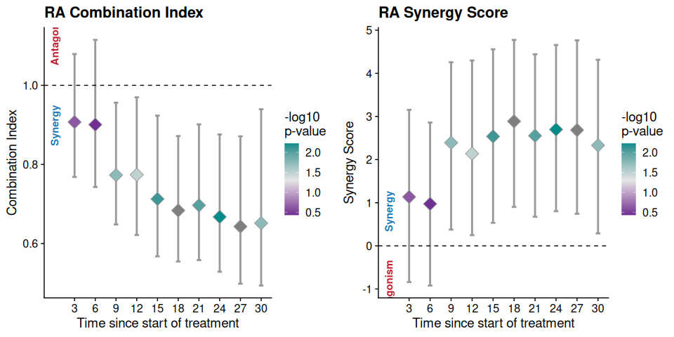

    #> $Contrasts
    #> NULL
    #> 
    #> $Synergy
    #>    Model Metric  Estimate        lwr       upr  pval Time
    #> 1     RA     CI 0.9048906  0.7742385 1.0616879 0.234    3
    #> 2     RA     CI 0.9030937  0.7374026 1.1294828 0.350    6
    #> 3     RA     CI 0.7773432  0.6381192 0.9561736 0.016    9
    #> 4     RA     CI 0.7673727  0.6380007 0.9809157 0.034   12
    #> 5     RA     CI 0.7099271  0.5817352 0.9079078 0.012   15
    #> 6     RA     CI 0.6784060  0.5564381 0.8953372 0.010   18
    #> 7     RA     CI 0.6979386  0.5549815 0.9007580 0.008   21
    #> 8     RA     CI 0.6718844  0.5343933 0.9140455 0.020   24
    #> 9     RA     CI 0.6423324  0.4945760 0.8776933 0.004   27
    #> 10    RA     CI 0.6566281  0.4976407 0.9523328 0.028   30
    #> 11    RA     SS 1.1585491 -0.6758954 3.0602037 0.234    3
    #> 12    RA     SS 0.9204681 -1.0165967 2.9601137 0.350    6
    #> 13    RA     SS 2.2781031  0.3845212 4.2561906 0.016    9
    #> 14    RA     SS 2.2654772  0.1470806 4.1322264 0.034   12
    #> 15    RA     SS 2.6824426  0.6915943 4.6413988 0.012   15
    #> 16    RA     SS 2.9291999  0.7560208 4.7227499 0.010   18
    #> 17    RA     SS 2.5322133  0.6975745 4.4590735 0.008   21
    #> 18    RA     SS 2.5580829  0.5203939 4.5054201 0.020   24
    #> 19    RA     SS 2.5661403  0.6450125 4.5840906 0.004   27
    #> 20    RA     SS 2.2155445  0.2190155 4.1523769 0.028   30
    #> 
    #> attr(,"SynergyLMM")
    #> [1] "lmmSynergy"

**Using Robust Estimates**

``` r
lmmSynergy(lmm, method = "Bliss", robust = TRUE)
#> Registered S3 method overwritten by 'clubSandwich':
#>   method    from    
#>   bread.mlm sandwich
```

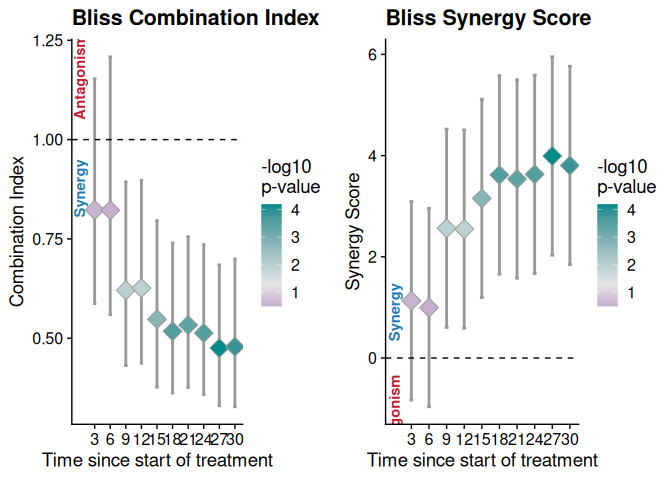

    #> $Contrasts
    #> $Contrasts$Time3
    #> 
    #>  Estimate Std. Error     z Pr(>|z|)   S  2.5 % 97.5 %
    #>   -0.0649     0.0574 -1.13    0.258 2.0 -0.177 0.0476
    #> 
    #> Term: b4 = b2 + b3 - b1
    #> Columns: term, estimate, std.error, statistic, p.value, s.value, conf.low, conf.high 
    #> 
    #> 
    #> $Contrasts$Time6
    #> 
    #>  Estimate Std. Error      z Pr(>|z|)   S   2.5 % 97.5 %
    #>   -0.0326     0.0327 -0.996    0.319 1.6 -0.0968 0.0316
    #> 
    #> Term: b4 = b2 + b3 - b1
    #> Columns: term, estimate, std.error, statistic, p.value, s.value, conf.low, conf.high 
    #> 
    #> 
    #> $Contrasts$Time9
    #> 
    #>  Estimate Std. Error     z Pr(>|z|)   S   2.5 %  97.5 %
    #>    -0.053     0.0207 -2.56   0.0103 6.6 -0.0935 -0.0125
    #> 
    #> Term: b4 = b2 + b3 - b1
    #> Columns: term, estimate, std.error, statistic, p.value, s.value, conf.low, conf.high 
    #> 
    #> 
    #> $Contrasts$Time12
    #> 
    #>  Estimate Std. Error     z Pr(>|z|)   S  2.5 %   97.5 %
    #>    -0.039     0.0153 -2.55   0.0108 6.5 -0.069 -0.00901
    #> 
    #> Term: b4 = b2 + b3 - b1
    #> Columns: term, estimate, std.error, statistic, p.value, s.value, conf.low, conf.high 
    #> 
    #> 
    #> $Contrasts$Time15
    #> 
    #>  Estimate Std. Error     z Pr(>|z|)   S  2.5 %  97.5 %
    #>   -0.0401     0.0127 -3.15  0.00161 9.3 -0.065 -0.0152
    #> 
    #> Term: b4 = b2 + b3 - b1
    #> Columns: term, estimate, std.error, statistic, p.value, s.value, conf.low, conf.high 
    #> 
    #> 
    #> $Contrasts$Time18
    #> 
    #>  Estimate Std. Error     z Pr(>|z|)    S   2.5 %  97.5 %
    #>   -0.0366     0.0101 -3.62   <0.001 11.7 -0.0564 -0.0168
    #> 
    #> Term: b4 = b2 + b3 - b1
    #> Columns: term, estimate, std.error, statistic, p.value, s.value, conf.low, conf.high 
    #> 
    #> 
    #> $Contrasts$Time21
    #> 
    #>  Estimate Std. Error     z Pr(>|z|)    S   2.5 %  97.5 %
    #>   -0.0299    0.00846 -3.54   <0.001 11.3 -0.0465 -0.0134
    #> 
    #> Term: b4 = b2 + b3 - b1
    #> Columns: term, estimate, std.error, statistic, p.value, s.value, conf.low, conf.high 
    #> 
    #> 
    #> $Contrasts$Time24
    #> 
    #>  Estimate Std. Error     z Pr(>|z|)    S   2.5 %  97.5 %
    #>   -0.0278    0.00766 -3.63   <0.001 11.8 -0.0428 -0.0128
    #> 
    #> Term: b4 = b2 + b3 - b1
    #> Columns: term, estimate, std.error, statistic, p.value, s.value, conf.low, conf.high 
    #> 
    #> 
    #> $Contrasts$Time27
    #> 
    #>  Estimate Std. Error     z Pr(>|z|)    S   2.5 % 97.5 %
    #>   -0.0275     0.0069 -3.99   <0.001 13.9 -0.0411 -0.014
    #> 
    #> Term: b4 = b2 + b3 - b1
    #> Columns: term, estimate, std.error, statistic, p.value, s.value, conf.low, conf.high 
    #> 
    #> 
    #> $Contrasts$Time30
    #> 
    #>  Estimate Std. Error     z Pr(>|z|)    S   2.5 %  97.5 %
    #>   -0.0246    0.00645 -3.81   <0.001 12.8 -0.0372 -0.0119
    #> 
    #> Term: b4 = b2 + b3 - b1
    #> Columns: term, estimate, std.error, statistic, p.value, s.value, conf.low, conf.high 
    #> 
    #> 
    #> 
    #> $Synergy
    #>    Model Metric  Estimate        lwr       upr         pval Time
    #> 1  Bliss     CI 0.8229665  0.5872062 1.1533834 2.579032e-01    3
    #> 2  Bliss     CI 0.8221770  0.5593887 1.2084173 3.190110e-01    6
    #> 3  Bliss     CI 0.6208242  0.4312539 0.8937256 1.033643e-02    9
    #> 4  Bliss     CI 0.6263864  0.4371340 0.8975735 1.081171e-02   12
    #> 5  Bliss     CI 0.5478166  0.3769351 0.7961665 1.605239e-03   15
    #> 6  Bliss     CI 0.5176217  0.3623022 0.7395270 2.972826e-04   18
    #> 7  Bliss     CI 0.5332866  0.3764318 0.7555010 4.037908e-04   21
    #> 8  Bliss     CI 0.5132132  0.3580036 0.7357127 2.831685e-04   24
    #> 9  Bliss     CI 0.4754203  0.3300312 0.6848579 6.535614e-05   27
    #> 10 Bliss     CI 0.4786726  0.3275199 0.6995835 1.416473e-04   30
    #> 11 Bliss     SS 1.1313609 -0.8286031 3.0913249 2.579032e-01    3
    #> 12 Bliss     SS 0.9964923 -0.9634717 2.9564563 3.190110e-01    6
    #> 13 Bliss     SS 2.5643665  0.6044025 4.5243305 1.033643e-02    9
    #> 14 Bliss     SS 2.5487265  0.5887625 4.5086905 1.081171e-02   12
    #> 15 Bliss     SS 3.1549531  1.1949891 5.1149171 1.605239e-03   15
    #> 16 Bliss     SS 3.6176565  1.6576925 5.5776205 2.972826e-04   18
    #> 17 Bliss     SS 3.5375938  1.5776298 5.4975577 4.037908e-04   21
    #> 18 Bliss     SS 3.6302303  1.6702663 5.5901942 2.831685e-04   24
    #> 19 Bliss     SS 3.9925877  2.0326237 5.9525517 6.535614e-05   27
    #> 20 Bliss     SS 3.8052741  1.8453101 5.7652380 1.416473e-04   30
    #> 
    #> attr(,"SynergyLMM")
    #> [1] "lmmSynergy"

### 3. Model Diagnostics

We can perform the model diagnostics using the following functions:

**Random Effects**

``` r
ranefDiagnostics(lmm)
```

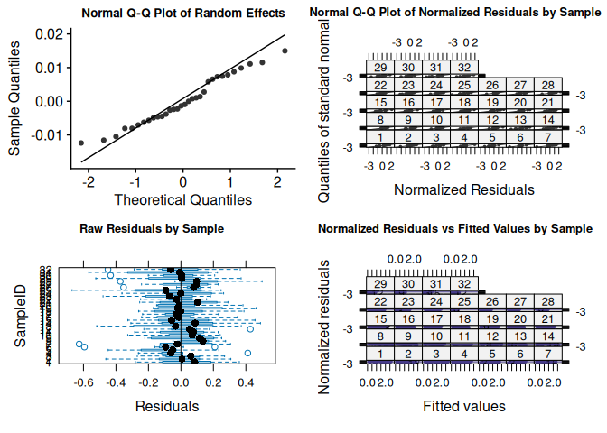

    #> 
    #> Title:
    #>  Shapiro - Wilk Normality Test of random effects
    #> 
    #> Test Results:
    #>   STATISTIC:
    #>     W: 0.9672
    #>   P VALUE:
    #>     0.4269 
    #> 
    #> 
    #> Title:
    #>  D'Agostino Normality Test of random effects
    #> 
    #> Test Results:
    #>   STATISTIC:
    #>     Chi2 | Omnibus: 2.2635
    #>     Z3  | Skewness: 0.6316
    #>     Z4  | Kurtosis: -1.3655
    #>   P VALUE:
    #>     Omnibus  Test: 0.3225 
    #>     Skewness Test: 0.5276 
    #>     Kurtosis Test: 0.1721 
    #> 
    #> 
    #> Title:
    #>  Anderson - Darling Normality Test of random effects
    #> 
    #> Test Results:
    #>   STATISTIC:
    #>     A: 0.3783
    #>   P VALUE:
    #>     0.3867 
    #> 
    #> 
    #> Normalized Residuals Levene Homoscedasticity Test by Sample
    #> Levene's Test for Homogeneity of Variance (center = median)
    #>        Df F value Pr(>F)
    #> group  31   0.874 0.6633
    #>       288               
    #> 
    #> Normalized Residuals Fligner-Killeen Homoscedasticity Test by Sample
    #> 
    #>  Fligner-Killeen test of homogeneity of variances
    #> 
    #> data:  normalized_resid by SampleID
    #> Fligner-Killeen:med chi-squared = 28.521, df = 31, p-value = 0.5942

**Residuals Diagnostics**

``` r
residDiagnostics(lmm)
```

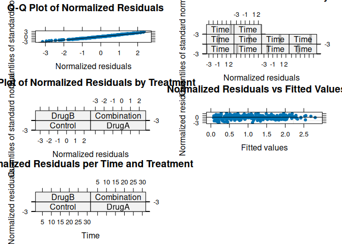

    #> 
    #> Title:
    #>  Shapiro - Wilk Normality Test
    #> 
    #> Test Results:
    #>   STATISTIC:
    #>     W: 0.9895
    #>   P VALUE:
    #>     0.02154 
    #> 
    #> Description:
    #>  Shapiro - Wilk Normality Test of normalized residuals
    #> 
    #> Title:
    #>  D'Agostino Normality Test
    #> 
    #> Test Results:
    #>   STATISTIC:
    #>     Chi2 | Omnibus: 9.4195
    #>     Z3  | Skewness: -2.704
    #>     Z4  | Kurtosis: 1.4519
    #>   P VALUE:
    #>     Omnibus  Test: 0.009007 
    #>     Skewness Test: 0.006851 
    #>     Kurtosis Test: 0.1465 
    #> 
    #> Description:
    #>  D'Agostino Normality Test of normalized residuals
    #> 
    #> Title:
    #>  Anderson - Darling Normality Test
    #> 
    #> Test Results:
    #>   STATISTIC:
    #>     A: 0.6813
    #>   P VALUE:
    #>     0.07456 
    #> 
    #> Description:
    #>  Anderson - Darling Normality Test of normalized residuals
    #> 
    #> Normalized Residuals Levene Homoscedasticity Test by Time
    #> Levene's Test for Homogeneity of Variance (center = median)
    #>        Df F value Pr(>F)
    #> group   9  0.4714 0.8934
    #>       310               
    #> 
    #> Normalized Residuals Fligner-Killeen Homoscedasticity Test by Time
    #> 
    #>  Fligner-Killeen test of homogeneity of variances
    #> 
    #> data:  normalized_resid by as.factor(Time)
    #> Fligner-Killeen:med chi-squared = 3.8143, df = 9, p-value = 0.9232
    #> 
    #> 
    #> Normalized Residuals Levene Homoscedasticity Test by Treatment
    #> Levene's Test for Homogeneity of Variance (center = median)
    #>        Df F value Pr(>F)
    #> group   3  0.5772 0.6304
    #>       316               
    #> 
    #> Normalized Residuals Fligner-Killeen Homoscedasticity Test by Treatment
    #> 
    #>  Fligner-Killeen test of homogeneity of variances
    #> 
    #> data:  normalized_resid by Treatment
    #> Fligner-Killeen:med chi-squared = 1.5405, df = 3, p-value = 0.673
    #> 
    #> [1] "Outlier observations"
    #>     SampleID Time   Treatment        TV        RTV     logRTV      TV0  idx
    #> 16         2   18     Control  512.1195  2.3886998  0.8707492 214.3926 TRUE
    #> 41         5    3     Control  197.1398  0.7938990 -0.2307990 248.3185 TRUE
    #> 51         6    3     Control  175.4958  0.6732778 -0.3955972 260.6588 TRUE
    #> 65         7   15     Control  357.3550  1.6397816  0.4945630 217.9284 TRUE
    #> 113       12    9       DrugA  514.0043  3.1708889  1.1540120 162.1010 TRUE
    #> 122       13    6       DrugA  179.3938  0.8896325 -0.1169469 201.6493 TRUE
    #> 135       14   15       DrugA  811.5854  5.8214346  1.7615467 139.4133 TRUE
    #> 149       15   27       DrugA 2182.0193 11.1771236  2.4138692 195.2219 TRUE
    #> 182       19    6       DrugB  425.3002  2.4226262  0.8848522 175.5534 TRUE
    #> 221       23    3       DrugB  187.7751  0.7226499 -0.3248305 259.8424 TRUE
    #> 243       25    9 Combination  185.9586  0.6374488 -0.4502813 291.7232 TRUE
    #> 272       28    6 Combination  317.8079  2.1773052  0.7780880 145.9639 TRUE
    #> 284       29   12 Combination  211.5939  0.8481839 -0.1646578 249.4670 TRUE
    #> 293       30    9 Combination  209.9097  0.8877339 -0.1190832 236.4557 TRUE
    #> 301       31    3 Combination  171.9011  0.7141648 -0.3366415 240.7023 TRUE
    #> 305       31   15 Combination  214.8480  0.8925879 -0.1136302 240.7023 TRUE
    #> 314       32   12 Combination  209.8804  0.8805177 -0.1272452 238.3602 TRUE

**Observed versus Predicted Values**

``` r
ObsvsPred(lmm)
#> # Indices of model performance
#> 
#> AIC    |   AICc |    BIC | R2 (cond.) | R2 (marg.) |  RMSE | Sigma
#> ------------------------------------------------------------------
#> 22.542 | 22.810 | 45.151 |      0.898 |      0.898 | 0.203 | 0.212
```

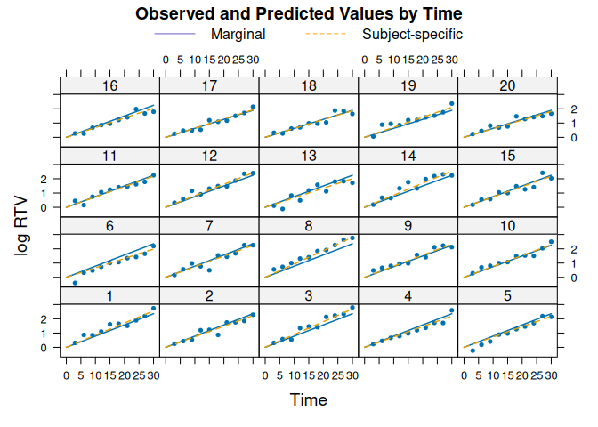

**Influential Diagnostics**

*log likelihood displacements*

``` r
logLikSubjectDisplacements(lmm)
#> [1] "Outliers with Log Likelihood displacement greater than: 0.534"
#>         6         8        25        28 
#> 0.6308934 1.1633552 0.5465657 0.5354518
```

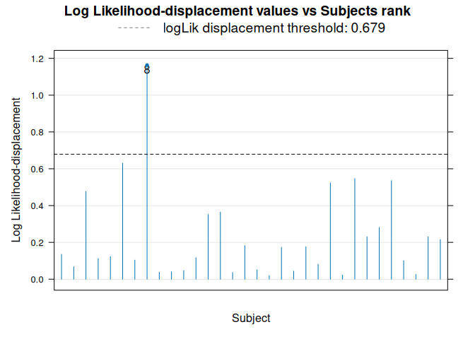

*Cook’s distances*

``` r
CookDistance(lmm)
#> [1] "Subjects with Cook's distance greater than: 0.091"
#>          6          8         23         28 
#> 0.10566141 0.15445612 0.09189548 0.09125189
```

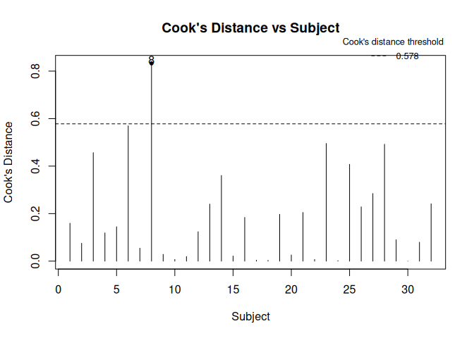

## 4. Power Analysis

**Post-Hoc Power Analysis**

``` r
PostHocPwr(lmm, method = "Bliss", time = 30)
#> [1] 0.963
```

**A Priori Power Analysis**

We will estimate the effect of sample size on statistical power based on
the estimates from our model:

``` r
# Vector with different sample sizes per group
npg <- 3:15

# Obtain model estimates
lmmestim <- lmmModel_estimates(lmm)

# Obtain time points

(timepoints <- unique(lmm$dt1$Time))
#>  [1]  0  3  6  9 12 15 18 21 24 27 30

# Calculate power depending on sample size per group

PwrSampleSize(
  npg = npg,
  time = timepoints,
  grwrControl = round(lmmestim$Control,3),
  grwrA = round(lmmestim$DrugA,3),
  grwrB = round(lmmestim$DrugB,3),
  grwrComb = round(lmmestim$Combination,3),
  sd_ranef = round(lmmestim$sd_ranef,3),
  sgma = round(lmmestim$sd_resid,3),
  method = "Bliss"
)
```

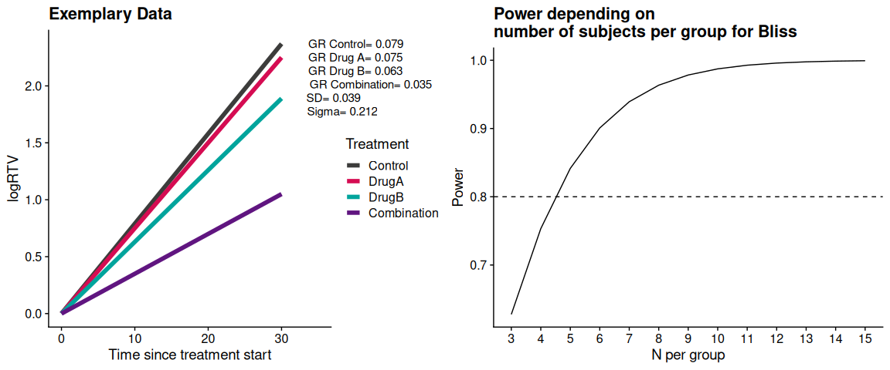
