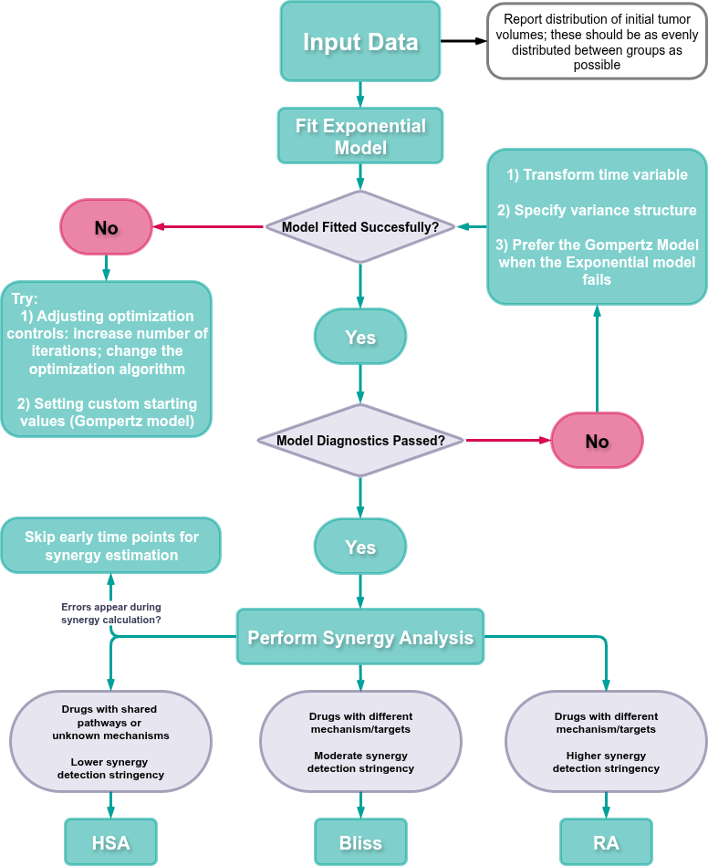
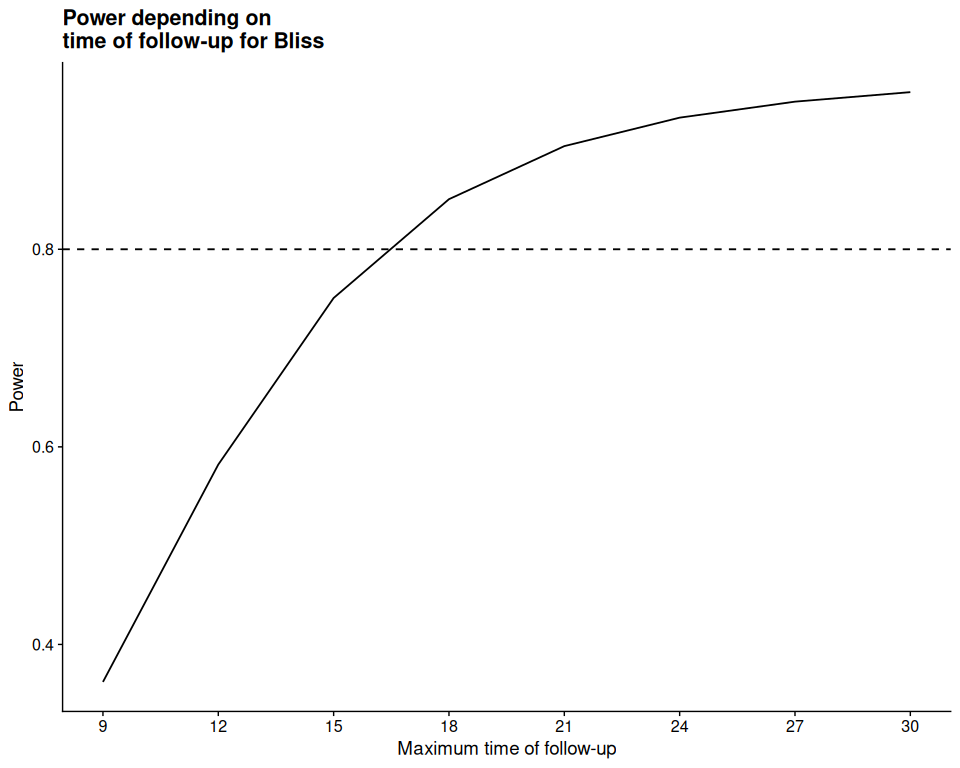
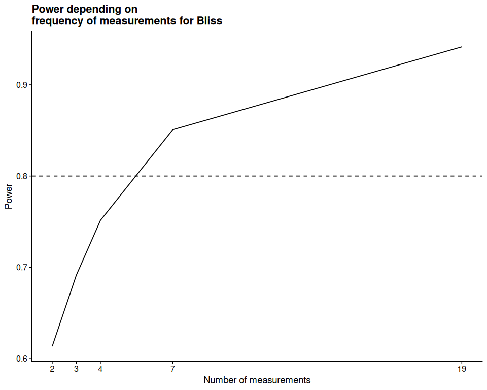
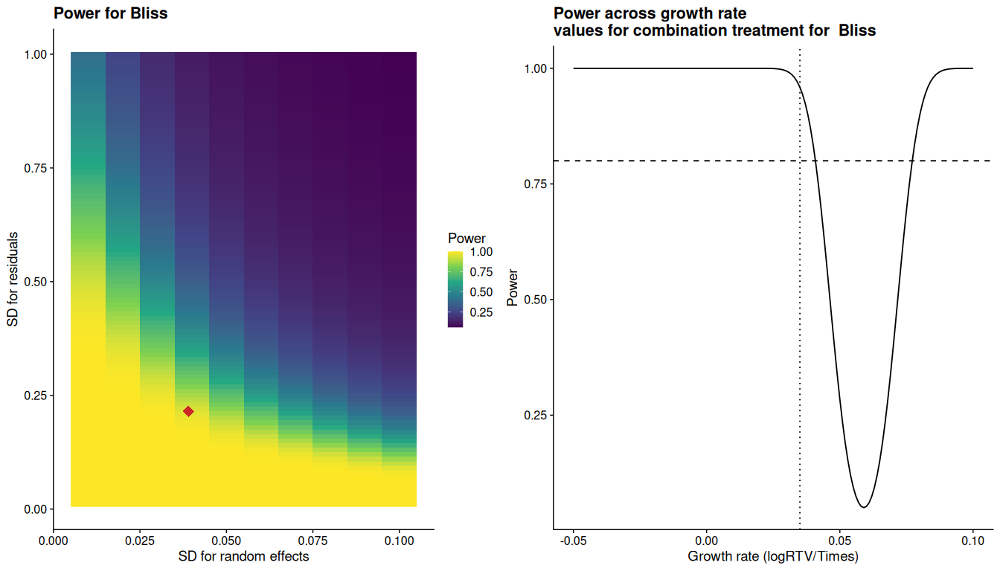

<!-- README.md is generated from README.Rmd. Please edit that file -->

# SynergyLMM <a href="https://cran.r-project.org/web/packages/SynergyLMM/vignettes/SynergyLMM.html"></a>

<!-- badges: start -->

[](https://CRAN.R-project.org/package=SynergyLMM)
[](https://lifecycle.r-lib.org/articles/stages.html#stable)
<!-- badges: end -->

A comprehensive statistical framework for designing and analyzing *in
vivo* drug combination experiments.

## Table of Contents

- [Installation](#installation)
- [Introduction](#introduction)
- [0. Recommended Workflow](#0-recommended-workflow)
- [1. Data Upload and Model Fit](#1-data-upload-and-model-fit)
- [1.1 Exponential Model Fitting](#11-exponential-model-fitting)
- [1.2 Gompertz Model Fitting](#12-gompertz-model-fitting)
- [1.3 Model Estimates](#13-model-estimates)
- [2. Model Diagnostics](#2-model-diagnostics)
- [2.1 Random Effects Diagnostics](#21-random-effects-diagnostics)
- [2.2 Residual Diagnostics](#22-residual-diagnostics)
- [2.3 Solutions for Violations of Model
  Diagnostics](#23-solutions-for-violations-of-model-diagnostics)
- [2.4 Model Performance](#24-model-performance)
- [2.5 Influential Diagnostics](#25-influential-diagnostics)
- [3. Synergy Analysis](#3-synergy-analysis)
- [4. Power Analysis](#4-power-analysis)
- [4.1 *Post Hoc* Power Analysis](#41-post-hoc-power-analysis)
- [4.2 *A Priori* Power Analysis](#42-a-priori-power-analysis)

## Installation

You can install the development version of SynergyLMM from
[GitHub](https://github.com/) with:

``` r
# install.packages("pak")
pak::pak("RafRomB/SynergyLMM")
```

Or you can install the [CRAN-released
version](https://cran.r-project.org/package=SynergyLMM) with:

``` r
install.packages("SynergyLMM")
```

## Wep-App

You can also use **SynergyLMM** directly in your browser at:
<https://synergylmm.uiocloud.no/>

## Introduction

This vignette describes the different functions provided in ‘SynergyLMM’
package to analyze drug combination effects in preclinical *in vivo*
studies.

We will follow the workflow for the analysis of a longitudinal tumor
growth experiments for the evaluation of the effect of a drug
combination and determine whether synergy (or antagonism) is present.

The following figure represent schematically ‘SynergyLMM’ workflow:

<figure>

<figcaption aria-hidden="true"><strong>Overview of the ‘SynergyLMM’
workflow. a,</strong> The first step is uploading the longitudinal tumor
burden-related measurements for the different treatment groups. The
input consists of a tabular data in long format with at least 4 columns
containing information about the samples IDs, the time points for each
measurement, the treatment group, and the tumor measurement.
<strong>b,</strong> The input data will then be processed to estimate
the linear mixed effect model that fits the tumor growth dynamics for
each subject, and estimate the growth rates for each treatment group.
<strong>c,</strong> ‘SynergyLMM’ offer various functions to evaluate the
model diagnostics and model performance, as well as for the
identification of potential outliers and influential individuals for the
model fit and the treatment groups. <strong>d,</strong> Once a proper
model with satisfactory diagnostics has been obtained, the statistical
assessment of combination effects is performed, with a time dependent
estimation of the synergy score and combination index, along with their
confidence intervals and statistical significance. The method allows for
testing synergy using three reference models: Bliss independence,
highest single agent (HSA), and response additivity (RA).
<strong>e,</strong> ‘SynergyLMM’ implements versatile functions to
calculate the <em>post hoc</em> power of the experiment and the <em>a
priori</em> power by modifying the values of key experimental variables,
such as sample size, follow-up time, or frequency of the
measurements.</figcaption>
</figure>

## 0. Recommended Workflow

<figure>

<figcaption aria-hidden="true"><strong>Recommended workflow for using
SynergyLMM</strong> to assess drug combination effects. HSA: highest
single agent. RA: response additivity.</figcaption>
</figure>

## 1. Data Upload and Model Fit

We will start by loading ‘SynergyLMM’ package:

``` r
library(SynergyLMM)
```

For this tutorial, we will use the example dataset that is included in
the package:

``` r
data("grwth_data")
```

Let’s have a look to these data:

``` r
head(grwth_data)
#>   subject Time Treatment TumorVolume
#> 1       1    0   Control    177.5810
#> 2       1    3   Control    242.5453
#> 3       1    6   Control    423.9744
#> 4       1    9   Control    416.6808
#> 5       1   12   Control    535.8457
#> 6       1   15   Control    891.7920
```

This is a typical example of *long data format*, in which each row is
one time point per subject. So each subject (mouse) will have data in
multiple rows. Any variables that don’t change across time will have the
same value in all the rows.

In this case, column `subject` indicates the sample ID for each mouse,
column `Time` indicates the time points (days) for each measurement,
column `Treatment` indicates the treatment group to which the mouse
belongs, and `TumorVolume` indicates the tumor volume measured for that
mouse at that specific time point.

It is important to note that the `TumorVolume` column contains the *raw*
measurements of tumor volume, in the sense that they have not been
normalized or transformed.

In this experiment there are 4 groups: the control group, each
mono-therapy group, and the drug combination group. Each group is
identified with the following names:

``` r
unique(grwth_data$Treatment)
#> [1] Control     DrugA       DrugB       Combination
#> Levels: Control DrugA DrugB Combination
```

The output shows the different names for each treatment. We can also see
that this column is stored as a `factor`. This is convenient, but not
necessary. Those are the four columns that the dataset must have to be
able to perform the analysis. The input data could have additional
columns, but they will be ignored.

### 1.1 Exponential Model Fitting

Let’s start with the analysis by fitting the model. This is done with
`lmmModel()` function:

``` r
lmm_ex <- lmmModel(
  data = grwth_data,
  grwth_model = "exp",
  sample_id = "subject",
  time = "Time",
  treatment = "Treatment",
  tumor_vol = "TumorVolume",
  trt_control = "Control",
  drug_a = "DrugA",
  drug_b = "DrugB",
  combination = "Combination"
)
```


This is the most basic use of the function to fit the model. The user
needs to specify the names of the columns containing the information for
the subject IDs, time points, treatment groups, tumor measurements, and
the names used to refer the different groups.

Note the argument `grwth_model = "exp"`. This means the model will be
fitted using a linear mixed-effect model assuming an **exponential tumor
growth**. Users can also use a **Gompertz growth model**, which is
presented in section [1.2 Gompertz Model
Fitting](#12-gompertz-model-fitting).

`lmmModel()` fits the model, which we have stored in the `lmm_ex`
object, and which we will use in the next steps. A plot with the tumor
growth data for the different groups is also produced. The bold lines in
the plots represent the fitted lines for the fixed effects of each
treatment estimated by the linear mixed-effect model. The x-axis
identifies the time since the start of treatment, being 0 the time of
treatment initiation. The y-axis represent the $\log$ of the relative
tumor volume ($RTV$).

There are several additional arguments in `lmmModel()` function:

- `time_start`: can be used to change the day that should be considered
  as the initial time point, which, by default, is the minimum value in
  `time` column.
- `time_end`: can be used to indicate the last time point to be included
  in the analysis, which, by default, is the maximum value in `time`
  column.
- `min_observations`: can be used to define the minimum number of
  observations (data points) that a subject should have to be considered
  in the analysis.
- `tum_vol_0`: this arguments allows to control the behavior regarding
  measurements in which the tumor measurement is 0, and therefore the
  logarithmic transformation is not possible. The user can choose to to
  ignore these measurements, or transform them, by adding 1 unit to all
  measurements before the $\log$ transformation.

### 1.2 Gompertz Model Fitting

While the exponential model is generally a good starting point for most
*in vivo* studies, and it tends to converge more easily, it may be
insufficient when tumor growth dynamics deviate significantly from
exponential behavior. In such cases, a Gompertz growth model typically
offers better flexibility and more accurate estimates of tumor growth
and treatment effects. Users can fit a non-linear mixed effect model
using a Gompertz growth model by specifying `grwth_model = "gompertz"`:

``` r
lmm_gomp <- lmmModel(
  data = grwth_data,
  grwth_model = "gompertz",
  start_values = "selfStart", 
  sample_id = "subject",
  time = "Time",
  treatment = "Treatment",
  tumor_vol = "TumorVolume",
  trt_control = "Control",
  drug_a = "DrugA",
  drug_b = "DrugB",
  combination = "Combination"
  )
```


When using the Gompertz growth model, setting
`start_values = "selfStart"` derives the initial values from a call to
`stats::nls`, which can facilitate successful model fitting.

### 1.3 Model Estimates

We can obtain the values of the **model estimates** using the function
`lmmModel_estimates()`. This function retrieves the information about
the estimated coefficients (tumor growth rates) for the different
experimental groups, as well as the standard deviation of the random
effects (between-subject variance) and residuals (within-subject
variance).

``` r
lmmModel_estimates(lmm_ex)
#>      Control sd_Control      DrugA   sd_DrugA      DrugB   sd_DrugB Combination
#> 1 0.07855242 0.00322683 0.07491984 0.00322683 0.06306986 0.00322683  0.03487933
#>   sd_Combination   sd_ranef  sd_resid
#> 1     0.00322683 0.03946667 0.2124122
```

## 2. Model Diagnostics

Before performing the synergy analysis, it is important to evaluate the
**model diagnostics** to check the main assumptions of the model: the
normality of the random effects and the residuals.

It is important to verify that the model is appropriate for the data.
Reliable results from statistical tests require that model assumptions —
such as normality and homoscedasticity of random effects and residuals —
are met. Therefore, users are recommended to thoroughly evaluate the
estimated model, as certain experimental data sets may result in highly
imprecise estimates.

### 2.1 Random Effects Diagnostics

To perform the diagnostics of the random effects we can use
`ranefDiagnostics()`. This function provides plots and results from
statistical tests to address the normality of the random effects. The
random effects in our model correspond to a random slope for each
subject, which takes into account the longitudinal nature of the data.
Additional plots and tests related to the normality and homoscedasticity
of the residuals for the subjects are also provided, which can help to
identify subjects with extreme behaviors, and which could potentially
being responsible for departure of the normality of random effects.

``` r
ranefDiagnostics(lmm_ex)
```


    #> 
    #> Normality Test of Random Effects
    #> $Time
    #> 
    #> Title:
    #>  Shapiro - Wilk Normality Test
    #> 
    #> Test Results:
    #>   STATISTIC:
    #>     W: 0.9672
    #>   P VALUE:
    #>     0.4269 
    #> 
    #> Description:
    #>  Normality Test of Time random effects
    #> 
    #> 
    #> Normalized Residuals Levene Homoscedasticity Test by Sample
    #> Levene's Test for Homogeneity of Variance (center = median)
    #>        Df F value Pr(>F)
    #> group  31   0.874 0.6633
    #>       288               
    #> 
    #> Normalized Residuals Fligner-Killeen Homoscedasticity Test by Sample
    #> 
    #>  Fligner-Killeen test of homogeneity of variances
    #> 
    #> data:  normalized_resid by SampleID
    #> Fligner-Killeen:med chi-squared = 28.521, df = 31, p-value = 0.5942

The most important plot is the Q-Q plot at the top left, which shows the
normal Q-Q plot of the random effects. The console output shows the
results of a Shapiro - Wilk normality tests for the random effects.
Other normalilty test are available with `norm_test` argument.

The normality of the random effects cannot be rejected if the p-value of
the normality test is not significant, and/or the Q-Q plot shows that
the data points approximately lie in the diagonal line. If some points
lie significantly outside the line, they could be potential outliers
that could be identified based on the residuals or in the **Influential
Diagnostics**.

The other plots address the normalized residuals by subject. The
top-right plot shows Q-Q plots of the normalized residuals by sample,
the bottom-left boxplot show the distribution of the normalized
residuals, to analyze if they are homoscedastic, and the bottom-right
plot shows the normalized residuals versus fitted values by subject, to
help to identify potential outlier observations, which are identified in
the scatter plots labelled with the time point corresponding to the
observation.

The console output also shows the results of Levene and Fligner-Killeen
homoscedasticity test of the normalized residuals by sample. The
homoscedasticity of the residuals among subjects cannot be rejected if
the p-value of these tests is not significant.

In this example, it can be observed how the normality of the random
effects cannot be rejected, although there are some outlier
observations, that may deserve further examination.

### 2.2 Residual Diagnostics

To perform the diagnostics of the random effects we can use
`residDiagnostics()` function. `residDiagnostics` provides several plots
as well as statistical test for the examination of the normality and
homoscedasticity of the normalized residuals of the input model.

One of the assumption of the model fit by `lmmModel()` is that the
residuals are normally distributed. For the evaluation of this
assumption, `residDiagnostics()` provides Q-Q plots of the normalized
residuals together with statistical assessment of their normality using
the normality test specified in `norm_test`. The Shapiro-Wilk normality
test is used by default. Additionally, Q-Q plots of the normalized
residuals by time point and treatment group are provided to be able to
detect time points or treatment groups which could be notably different
from the others and be affecting the adequacy of the model.

Scatter plots of the normalized residuals versus fitted values and
normalized residuals per time and per treatment are also provided to
give information about variability of the residuals and possible outlier
observations. These plots are accompanied by Levene and Fligner-Killend
homogeneity of variance test results.

Finally, potential outlier observations are also returned.

``` r
residDiagnostics(lmm_ex)
```


    #> 
    #> Normalized Residuals Normality Test
    #> 
    #> Title:
    #>  Shapiro - Wilk Normality Test
    #> 
    #> Test Results:
    #>   STATISTIC:
    #>     W: 0.9895
    #>   P VALUE:
    #>     0.02154 
    #> 
    #> 
    #> Normalized Residuals Levene Homoscedasticity Test by Time
    #> Levene's Test for Homogeneity of Variance (center = median)
    #>        Df F value Pr(>F)
    #> group   9  0.4714 0.8934
    #>       310               
    #> 
    #> Normalized Residuals Fligner-Killeen Homoscedasticity Test by Time
    #> 
    #>  Fligner-Killeen test of homogeneity of variances
    #> 
    #> data:  normalized_resid by as.factor(Time)
    #> Fligner-Killeen:med chi-squared = 3.8143, df = 9, p-value = 0.9232
    #> 
    #> 
    #> Normalized Residuals Levene Homoscedasticity Test by Treatment
    #> Levene's Test for Homogeneity of Variance (center = median)
    #>        Df F value Pr(>F)
    #> group   3  0.5772 0.6304
    #>       316               
    #> 
    #> Normalized Residuals Fligner-Killeen Homoscedasticity Test by Treatment
    #> 
    #>  Fligner-Killeen test of homogeneity of variances
    #> 
    #> data:  normalized_resid by Treatment
    #> Fligner-Killeen:med chi-squared = 1.5405, df = 3, p-value = 0.673
    #> 
    #> 
    #> Outlier observations
    #>     SampleID Time   Treatment        TV        RTV     logRTV      TV0
    #> 16         2   18     Control  512.1195  2.3886998  0.8707492 214.3926
    #> 41         5    3     Control  197.1398  0.7938990 -0.2307990 248.3185
    #> 51         6    3     Control  175.4958  0.6732778 -0.3955972 260.6588
    #> 65         7   15     Control  357.3550  1.6397816  0.4945630 217.9284
    #> 113       12    9       DrugA  514.0043  3.1708889  1.1540120 162.1010
    #> 122       13    6       DrugA  179.3938  0.8896325 -0.1169469 201.6493
    #> 135       14   15       DrugA  811.5854  5.8214346  1.7615467 139.4133
    #> 149       15   27       DrugA 2182.0193 11.1771236  2.4138692 195.2219
    #> 182       19    6       DrugB  425.3002  2.4226262  0.8848522 175.5534
    #> 221       23    3       DrugB  187.7751  0.7226499 -0.3248305 259.8424
    #> 243       25    9 Combination  185.9586  0.6374488 -0.4502813 291.7232
    #> 272       28    6 Combination  317.8079  2.1773052  0.7780880 145.9639
    #> 284       29   12 Combination  211.5939  0.8481839 -0.1646578 249.4670
    #> 293       30    9 Combination  209.9097  0.8877339 -0.1190832 236.4557
    #> 301       31    3 Combination  171.9011  0.7141648 -0.3366415 240.7023
    #> 305       31   15 Combination  214.8480  0.8925879 -0.1136302 240.7023
    #> 314       32   12 Combination  209.8804  0.8805177 -0.1272452 238.3602
    #>     normalized_resid
    #> 16         -2.175456
    #> 41         -2.107815
    #> 51         -2.796859
    #> 65         -2.948355
    #> 113         2.013734
    #> 122        -2.439570
    #> 135         2.306236
    #> 149         2.147614
    #> 182         2.178362
    #> 221        -2.256830
    #> 243        -3.153712
    #> 272         2.352650
    #> 284        -2.467379
    #> 293        -2.037821
    #> 301        -2.012043
    #> 305        -2.670916
    #> 314        -2.113725

As we can see, there is some departure from the normality of the
residuals, as indicated by the normality tests and the top-left Q-Q
plot. Additionally, there are several potential outlier observations
according to their normalized residuals.

### 2.3 Solutions for Violations of Model Diagnostics

When diagnostic plots and tests show evident violations of the model
assumptions, there are several solutions that may help improving the
model:

1.  Transform the time variable: Both exponential and Gompertz models
    are based on ordinary differential equations (ODEs), which can be
    formulated using arbitrary time scales. Applying transformations,
    such as the square root or logarithm (with +1 offset), can often
    improve model fit, enhance linearity, stabilize variance, and ensure
    better numerical performance. Importantly, when comparing the exact
    values of a drug combination synergy index, the models should use
    the same timescale.

2.  Specify residual variance structure: SynergyLMM uses the `nlme` R
    package, which supports flexible variance and correlation
    structures. These allow for heterogeneous variances or within-group
    correlations, such as those based on subject, time point, treatment,
    or combinations of these. Applying these structures can
    substantially improve model diagnostics and the robustness of the
    estimates. This can be done with the `weights` argument in the
    `lmmModel()` function.

3.  Carefully address potential outliers. Individuals or measurements
    highlighted as potential outliers may warrant further investigation
    to reveal the reasons behind unusual growth behaviors, and
    potentially exclude these before reanalysis, after careful reporting
    and justification.

4.  Prefer the Gompertz model when the exponential model fails: While
    the exponential model is generally a good starting point for most
    *in vivo* studies, and it tends to converge more easily, it may be
    insufficient when tumor growth dynamics deviate significantly from
    exponential behavior. In such cases, the Gompertz model typically
    offers better flexibility and more accurate estimates of tumor
    growth and treatment effects.

We will try to improved the model by defining unequal variances for the
errors. We can do this providing an additional argument, `weights`, when
fitting the model, which will be passed to `nlme::lme()` function. For
example, we can define the model adding a variance function to represent
a different variance per subject using `nlme::varIdent()` function:

``` r
lmm_ex_var <- lmmModel(
  data = grwth_data,
  sample_id = "subject",
  time = "Time",
  treatment = "Treatment",
  tumor_vol = "TumorVolume",
  trt_control = "Control",
  drug_a = "DrugA",
  drug_b = "DrugB",
  combination = "Combination",
  weights = nlme::varIdent(form = ~ 1 | SampleID),
  show_plot = FALSE
)
```

If we obtain the model estimates from this new model:

``` r
lmmModel_estimates(lmm_ex_var)
#>      Control sd_Control      DrugA    sd_DrugA      DrugB   sd_DrugB
#> 1 0.07888867 0.00318583 0.07496401 0.003194576 0.06308966 0.00315647
#>   Combination sd_Combination  sd_ranef  sd_resid
#> 1  0.03535055    0.003249592 0.0386823 0.2148223
```

We can observe that the values are slightly different from the previous
`lmm_ex` model.

You can also try defining:

- A different variance per time using `nlme::varIdent(form = ~1|Time)`.
- A different variance per treatment group, using
  `nlme::varIdent(form = ~1|Treatment)`.
- Combinations of them using `nlme::varComb()` function.

We can now evaluate the diagnostics of the new model. We will use the
option `verbose = FALSE` to avoid printing all the results in the
console:

**Random Effects**

``` r
ranefD <- ranefDiagnostics(lmm_ex_var, verbose = FALSE)
```


``` r

# We can access to individual results of the diagnostics:
ranefD$Normality
#> $Time
#> 
#> Title:
#>  Shapiro - Wilk Normality Test
#> 
#> Test Results:
#>   STATISTIC:
#>     W: 0.9671
#>   P VALUE:
#>     0.423 
#> 
#> Description:
#>  Normality Test of Time random effects
```

**Residuals**

``` r
residD <- residDiagnostics(lmm_ex_var, verbose = FALSE)
```


``` r
residD$Normality
#> 
#> Title:
#>  Shapiro - Wilk Normality Test
#> 
#> Test Results:
#>   STATISTIC:
#>     W: 0.9945
#>   P VALUE:
#>     0.31
```

It can be observed there is no evidence of violation of the assumptions
in the new model.

### 2.4 Model Performance

Another useful function to evaluate the model is `ObsvsPred()`.
`ObsvsPred` allows the user to have a straight forward idea about how
the model is fitting the data, providing plots of the predicted
regression lines versus the actual data points.

``` r
ObsvsPred(lmm_ex_var, nrow = 8, ncol = 4)
```


    #> # Indices of model performance
    #> 
    #> AIC  | AICc |   BIC | R2 (cond.) | R2 (marg.) |  RMSE | Sigma
    #> -------------------------------------------------------------
    #> 58.1 | 68.1 | 197.5 |      0.896 |      0.896 | 0.204 | 0.215

This function provides visual and quantitative information about the
performance of the model:

- A layout of the observed and predicted values of $\log$(relative tumor
  volume) vs Time for each SampleID (i.e. subject). The actual
  measurements are shown as blue dots, the dashed orange line indicates
  the regression line for each subject, while the continuous blue line
  indicates the marginal, treatment-specific, regression line for each
  treatment group.

- Performance metrics of the model calculated using
  `performance::model_performance()`. The maximum likelihood-based
  Akaike’s Information Criterion (AIC), small sample AIC (AICc), and
  Bayesian Information Criterion, and the Nakagawa’s r-squared root mean
  squared error (RMSE) of the residuals, and the standard deviation of
  the residuals (sigma) are provided.

Smaller values of AIC, AICc, BIC, RMSE, and sigma of the residuals
indicate a better-fitting model. $R^2$ values range from 0 to 1. An
$R^2$ value closer to 1 suggests that the model explains a larger
proportion of the variance in the data, indicating a better fit.

As we can see in the plots and the metrics, the model fits quite well
the data, obtaining a high $R^2$ value.

### 2.5 Influential Diagnostics

Influential diagnostics allow the user to identify highly influential
subjects (animals) in the experiment. These options include detecting
those subjects with greater influence on the estimation of control and
treatment group fixed effects, and subjects with greater influence on
the fitted values, as evaluated using Cook’s distances using
`CookDistances()`. For the exponential model, users can also identify
subjects with a substantial impact on the overall model, as assessed
with log-likelihood displacements using `logLikSubjectDisplacements()`
function. Log-likelihood displacements are only available for models
fitted using the exponential growth model.

In our data we don’t have subjects that seem to be outliers with a high
influence in the model, but we can easily check the results of the
influential diagnostics with these functions:

**Cook’s Distances based on the change of fixed effect values**

``` r
CookDistance(lmm_ex_var, type = "fixef")
```


**Cook’s Distances based on the change of fitted values**

``` r
CookDistance(lmm_ex_var, type = "fitted")
```


It seems that subject 8 is a subject with a remarkable influence in
both, the fixed effect values, and the fitted values.

We can check the log-likelihood displacements. Since we have defined a
variance structure in the model, we need to specify an additional
argument in the function, `var_name`:

``` r
logLikSubjectDisplacements(lmm_ex_var, var_name = "SampleID")
```


Again, subject 8 seems to be having a higher influence in the model.

In a real data analysis, this results suggest that maybe the researcher
should review the data regarding subject 8, to try to identify any
reasons for the different behavior of this subject.

## 3. Synergy Analysis

After the careful examination of the model diagnostics and being sure
that our model is correctly specified, we can proceed to the synergy
analysis, using `lmmSynergy()` function.

`lmmSynergy()` allows for the calculation of synergy using 3 different
references models: Bliss independence, highest single agent (HSA), and
response additivity (RA). The calculation of synergy is based on
hypothesis testing on the coefficient estimates from the model fitted by
`lmmModel()`.

We will perform the analysis for the **Bliss independence model**

When a variance structure has been specified, it is recommended to set
the argument `robust = TRUE`, to use cluster-robust variance estimation
using `clubSandwich::vcovCR.lme()`.

``` r
bliss <- lmmSynergy(lmm_ex_var, method = "Bliss", robust = TRUE)
#> Registered S3 method overwritten by 'clubSandwich':
#>   method    from    
#>   bread.mlm sandwich
#> Error in big_mat[ind, ind] <- small_mat[[i]] + big_mat[ind, ind]: replacement has length zero
```

However, as it can be seen, sometimes this can result in some errors,
due to the impossibility to fit the model at the earlier time points
(due to convergence problems caused by insufficient data compared to the
number of parameters to estimate). In these cases, an easy solution is
to simply increase the value of the `min_time` argument, to increase the
minimum time for which to start calculating the synergy:

``` r
bliss <- lmmSynergy(lmm_ex_var, method = "Bliss", robust = TRUE, min_time = 6)
```


Now we can observe the results, which indicate that the drug combination
effect is synergistic through all the time points.

The synergy analysis results can be obtained from the object as:

``` r
bliss$Synergy
#>    Model Metric  Estimate       lwr       upr         pval Time
#> 1  Bliss     CI 0.7668269 0.6754590 0.8705540 4.103824e-05    6
#> 2  Bliss     CI 0.6714793 0.5083305 0.8869906 5.041554e-03    9
#> 3  Bliss     CI 0.6711078 0.4856233 0.9274384 1.567663e-02   12
#> 4  Bliss     CI 0.5701287 0.4040469 0.8044779 1.382189e-03   15
#> 5  Bliss     CI 0.5420798 0.3818478 0.7695488 6.142903e-04   18
#> 6  Bliss     CI 0.5451376 0.3879895 0.7659356 4.707607e-04   21
#> 7  Bliss     CI 0.5229272 0.3662528 0.7466234 3.595666e-04   24
#> 8  Bliss     CI 0.4820073 0.3346676 0.6942145 8.827451e-05   27
#> 9  Bliss     CI 0.4894694 0.3357710 0.7135230 2.029750e-04   30
#> 10 Bliss     SS 4.1015553 2.1415913 6.0615193 4.103824e-05    6
#> 11 Bliss     SS 2.8043667 0.8444027 4.7643306 5.041554e-03    9
#> 12 Bliss     SS 2.4163583 0.4563943 4.3763223 1.567663e-02   12
#> 13 Bliss     SS 3.1983449 1.2383809 5.1583089 1.382189e-03   15
#> 14 Bliss     SS 3.4252251 1.4652611 5.3851891 6.142903e-04   18
#> 15 Bliss     SS 3.4968646 1.5369006 5.4568286 4.707607e-04   21
#> 16 Bliss     SS 3.5681092 1.6081452 5.5280732 3.595666e-04   24
#> 17 Bliss     SS 3.9207481 1.9607841 5.8807121 8.827451e-05   27
#> 18 Bliss     SS 3.7152848 1.7553208 5.6752488 2.029750e-04   30
```

This data frame contains the synergy results, indicating the model of
synergy (“Bliss”, “HSA” or “RA”), the metric (combination index and
synergy score), the value of the metric estimate (with upper and lower
confidence interval bounds) and the p-value, for each time.

We can repeat the process for the **highest single agent (HSA)** model:

``` r
hsa <- lmmSynergy(lmm_ex_var, method = "HSA", robust = TRUE, min_time = 6)
```


As expected the results are similar, indicating synergy, but with
smaller p-values compared to the Bliss model.

Finally, we can test the **response additivity (RA)** model. The
assessment of drug combination effect using this model is based on
simulations. We can choose the number of simulations to perform with the
`ra_nsim` parameter. For this example, we will set it to 100 to reduce
the computational time :

``` r
ra <- lmmSynergy(lmm_ex_var, method = "RA", robust = TRUE, min_time = 6, nsim = 100)
#> Warning in lmmSynergy.explme(lmm_ex_var, method = "RA", robust = TRUE, min_time
#> = 6, : p-values below p<1e-02 are approximated to 0. If you used method = 'RA'
#> consider increasing 'nsim' value for more precise p-values.
```

 Since we
performed 100 simulations, the minimum p-value is 0.01. If we would like
to obtain more precise p-values, we should run the analysis increasing
the number of simulations.

## 4. Power Analysis

‘SynergyLMM’ implements statistical power analysis to improve
experimental designs.

*Post-hoc* and *a priori* power analysis are only available for models
fitted using the exponential growth model.

### 4.1 *Post Hoc* Power Analysis

The *post hoc* (retrospective) power analysis allows to evaluate the
statistical power for the provided data set and fitted model.
Traditionally, a threshold of 0.8 (80%) is used as an acceptable level
of power ([Serdar CC et al.,
2021](https://www.biochemia-medica.com/en/journal/31/1/10.11613/BM.2021.010502)).

‘SynergyLMM’ allows for the *post hoc* power analysis of the synergy
hypothesis testing for Bliss and HSA reference models for a given tumor
growth data with `PostHocPwr()` function.

Since the drug combination effect is time-dependent, the statistical
power vary depending on the time point being analyzed. We can choose
which time point to analyse using the `time` argument.

The post hoc power analysis is based on simulations. We can specify the
number of simulations to run using the `nsim` argument. For this
example, we will run only 50 simulations to reduce the computational
time:

If we don’t specify any day, the last time point is used by default (in
this case, day 30):

``` r
PostHocPwr(lmm_ex_var, nsim = 50, method = "Bliss")
#> [1] 0.98
```

We can see that the analysis provides a good statistical power.

### 4.2 *A Priori* Power Analysis

Prospective, *a priori*, statistical power analysis allows to assess how
the statistical power of the analysis varies with variations of some
parameters such as the sample size, or drug combination effect size,
while keeping the other parameters constant. The *a priori* power
analysis can help to implement improved experimental designs for *in
vivo* experiments with minimal number of animals and measurements, yet
still having enough statistical power to detect true synergistic
effects.

#### Sample Size Power Analysis

`PwrSampleSize()` allows to calculate the *a priori* statistical power
with different sample sizes. We can modify any of the parameters, such
as the time points of the experiment, the growth rate of the different
groups, or the variance in the model (given by the standard deviation of
the random effects and residuals).

However, usually the researcher will be interested in analyzing the *a
priori* power for an experiment, to check, for example, which sample
size should be used in order to reach an appropriate statistical power.
We can do this using the `lmmModel_estimates()` function, to retrieve
the model estimates from the experiment, and then play with the
different parameters:

First, lets extract the information from our experiment:

``` r
# Vector with the time points
days <- unique(grwth_data$Time)

# Model estimates
estimates <- lmmModel_estimates(lmm_ex_var)
```

Now, we can evaluate the *a priori* power for this experiment, varying
the sample size per group. For example, let’s evaluate how the sample
size varies from 1 to 10 subjects per group:

``` r
PwrSampleSize(npg = 1:10,
              time = days,
              grwrControl = round(estimates$Control,3),
              grwrA = round(estimates$DrugA,3),
              grwrB = round(estimates$DrugB, 3),
              grwrComb = round(estimates$Combination, 3),
              sd_ranef = round(estimates$sd_ranef, 3),
              sgma = round(estimates$sd_resid, 3),
              method = "Bliss")
```


    #>     N     Power
    #> 1   1 0.2482717
    #> 2   2 0.4493088
    #> 3   3 0.6155939
    #> 4   4 0.7415295
    #> 5   5 0.8313583
    #> 6   6 0.8926689
    #> 7   7 0.9331076
    #> 8   8 0.9590544
    #> 9   9 0.9753267
    #> 10 10 0.9853362

The plot on the left represents the hypothetical data that we have
provided, with the regression lines for each treatment group according
to `grwrControl`, `grwrA`, `grwrB`, and `grwrComb` values. The values
assigned to `sd_ranef` and `sgma` are also shown.

The plot on the left shows the values of the power calculation depending
on the values assigned to `npg`. We can observed that, for this
experiment, a sample size of 5 would be enough to reach 0.8 statistical
power.

#### Time Power Analysis

The number of measurement points per subject is another experimental
factor that can influence the experimental design and statistical power.
This depends on the duration of tumor growth follow-up and the frequency
of the measurements during that period. `PwrTime()` function allows for
the *a priori* power calculation of a a hypothetical two-drugs
combination study of synergy depending on the time of follow-up or the
frequency of measurements.

For example, the researcher may be interested in studying the
statistical power of the experiment depending on the time of follow-up,
to decide the appropriate end point. If we set the argument
`type = "max"` in `PwrTime()` function, we can evaluate how the power
varies at different end times. For this, we need to provide the function
with a list of vectors with the times at which the tumor measurements
are performed. As we are interested in addressing how the power varies
for different study duration, the measurement should be taken at the
same intervals.

Let’s see an example. Using the estimates from the model we have fitted
previously, we can explore how the power varies if the study ends in a
range from 9 to 30 days, with measurements performed every 3 days.

The first step is to define the list of vectors tumor measurements time
points:

``` r
max_time <- list(seq(0,9,3), seq(0,12,3), seq(0,15,3), 
                 seq(0,18,3), seq(0,21,3), seq(0,24,3), 
                 seq(0,27,3), seq(0,30,3))
```

Another argument for the function is `npg`, which indicates the sample
size per group. As we are interested in calculate the *a priori* power
for different study duration in our experiment and model, we will use
the mean sample size per group in the experiment:

``` r
# We can calculate the average sample size dividing the number of subjects
# by the number of groups, in this case, 4 groups
(npg <- round(length(unique(grwth_data$subject))/4,0))
#> [1] 8
```

Now, the *a priori* power for the Bliss independence model at different
end points of the study is:

``` r
PwrTime(npg = npg,
        time = max_time,
        type = "max",
        grwrControl = round(estimates$Control,3),
              grwrA = round(estimates$DrugA,3),
              grwrB = round(estimates$DrugB, 3),
              grwrComb = round(estimates$Combination, 3),
              sd_ranef = round(estimates$sd_ranef, 3),
              sgma = round(estimates$sd_resid, 3),
              method = "Bliss")
```



    #>   Time     Power
    #> 1    9 0.3620678
    #> 2   12 0.5821139
    #> 3   15 0.7506802
    #> 4   18 0.8507028
    #> 5   21 0.9044000
    #> 6   24 0.9332249
    #> 7   27 0.9494161
    #> 8   30 0.9590544

We can observe that a study with a follow-up time of 18 days would be
enough to achieve a statistical power \> 0.8, if all the other variables
do not vary.

Now, we may also wonder how frequently the measurements should be taken.
Is it necessary to take measurements every 3 days, or can we reduce the
measurements to every 6 days?

We can do this by setting the `type = "freq"` argument in `PwrTime()`
function. In this case, we need to provide a list of vectors with the
tumor measurements with the same maximum time of follow-up, but changing
the intervals at which the measurements have been taken. Let’s first
define this list. We will evaluate how many measurements are needed in
an experiment with a follow-up period of 18 days.

``` r
freq_time <- list(seq(0,18,1), seq(0,18,3), seq(0,18,6), seq(0,18,9),seq(0,18,18))
```

Now, let’s analyze the *a priori* power:

``` r
PwrTime(npg = npg,
        time = freq_time,
        type = "freq",
        grwrControl = round(estimates$Control,3),
        grwrA = round(estimates$DrugA,3),
        grwrB = round(estimates$DrugB, 3),
        grwrComb = round(estimates$Combination, 3),
        sd_ranef = round(estimates$sd_ranef, 3),
        sgma = round(estimates$sd_resid, 3),
        method = "Bliss")
```



    #>   Time     Power
    #> 1   19 0.9416027
    #> 2    7 0.8507028
    #> 3    4 0.7513935
    #> 4    3 0.6913582
    #> 5    2 0.6134500

The plot at the right shows the power for different number of (evenly)
distributed measurements. 2 measurements correspond to an experiment in
which the tumor measurements were taken just at the initial time point
(day 0), and at the final time point (day 18), while 19 measurements
correspond to an experiment in which the measurements were taken every
single day, including day 0.

The results show that with 4 measurements, which corresponds to take
measurements every 6 days, the statistical power is close to 0.8.

#### Variability Power Analysis

A key determinant of statistical power is the effect size of the drug
combination effect, given by the magnitude of the estimated coefficient
for the growth rate after combination treatment, relative to that
observed in the monotherapy and control groups. Treatments with larger
effect sizes are easier to detect, even with smaller sample sizes,
resulting in higher statistical power. Another critical factor is the
variance components of the model, including residual variance
(within-subject variance) and random effects variance (between-subject
variance). High estimated coefficients for these variances reduce
precision, thereby diminishing statistical power.

`APrioriPwr()` function allows for total customization of an
hypothetical drug combination study and allows the user to define
several experimental parameters, such as the sample size, time of
measurements, or drug effect, for the power evaluation of synergy for
Bliss and HSA reference models.

Usually, we will define a experiment with the estimated parameters from
the input data and fitted model, and then play with different values of
the effect size of the drug combination effect, and/or values of
residual and random effects variance.

From our model, the estimated parameters are:

``` r
estimates
#>      Control sd_Control      DrugA    sd_DrugA      DrugB   sd_DrugB
#> 1 0.07888867 0.00318583 0.07496401 0.003194576 0.06308966 0.00315647
#>   Combination sd_Combination  sd_ranef  sd_resid
#> 1  0.03535055    0.003249592 0.0386823 0.2148223
```

Then, we can for example, evaluate how the statistical power varies if
the drug combination group estimate ranges from -0.03 to 0.06, or if the
standard deviation of the random effects ranges from 0.01 to 0.1 and the
standard deviation of the residuals ranges from 0.01 to 1, using the
Bliss independence model:

``` r
APrioriPwr(npg = npg, # Sample size per group, calculated above
           time = days, # Time points of measurements, calculated above
           # Model estimates:
           grwrControl = round(estimates$Control,3),
           grwrA = round(estimates$DrugA,3),
           grwrB = round(estimates$DrugB, 3),
           grwrComb = round(estimates$Combination, 3),
           sd_ranef = round(estimates$sd_ranef, 3),
           sgma = round(estimates$sd_resid, 3),
           sd_eval = seq(0.01, 0.1, 0.01),
           sgma_eval = seq(0.01, 1, 0.01),
           grwrComb_eval = seq(-0.05, 0.1, 0.001)
           )
```



    #>   numDF denDF  F-value       nc     Power
    #> 1     1   317 13.77187 13.77187 0.9590544

The red dot and the vertical line in the two plots on the right indicate
the power result corresponding to the values assigned to `sd_ranef`,
`sgma`, and `grwrComb`, respectively.

The results demonstrate that the power increases as the residual and
random effects variances decrease. Furthermore, the plot on the right
reveals a U-shaped power profile as a function of the combination group
growth rate. This indicates that with lower growth rates (i.e., higher
effect size), the power is increased for detecting synergy, but it
decreases as growth rates approach the expected additive effect under
the Bliss independence model until it reaches its minimum. As growth
rates exceed the expected additive effect, the power starts to increase
again, reflecting the model’s ability to detect negative deviations from
additivity (indicating antagonism).

All these functions constitute an interesting toolbox for the
researcher. One may perform a first pilot experiment, and then optimize
the study design based on the data from that experiment.
